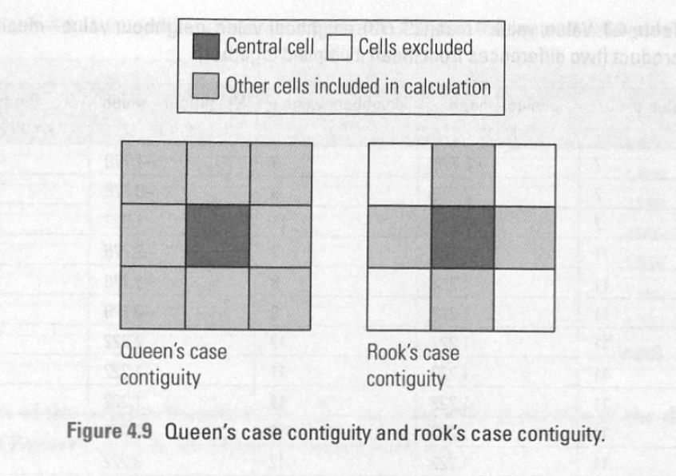

## Getting Started

In this hands-on exercise, we'll learn how to compute spatial weights using R (spded library).

::: {.callout-note title="What is spatial weights: "}
-   Spatial relationship among geographic areas can be defined mathematically
-   It is ordinary data that has geography attributes and you want to know if the observed **geographical patterns are randomly distributed since geovisualization is not enough** since visual representation can change if you simply used a different data classification techniques
:::

## Import Libraries

```{r}
pacman::p_load(sf, spdep, tmap, tidyverse, knitr)
```

The libraries used in this exercise would be:

-   sf: simple features in R to encode and analyze spatial vector data

-   spdep: create spatial weights matrix objects from polygon 'contiguities', from polygon contiguity, from point patterns by distance and tessellations.

-   tmap: used to draw thematic map

-   tidyverse: collection of R packages that for data manipulation and visualization

-   knitr: flexible and fast dynamic report generation with R

## The Data

In this hands-on exercise, we'll be using Hunan county boundary layer and Hunan_2012.csv which contain selected Hunan's local development indicators in 2012.

## Import Data

We'll use st_read() to import Hunan shapefile.

```{r}
hunan <- st_read(dsn = "data/geospatial", 
                 layer = "Hunan")
```

While we'll use read_csv() for the Hunan_2012.csv file

```{r}
hunan2012 <- read_csv("data/aspatial/Hunan_2012.csv")
```

Next, we'll join both of the dataframe using the left_join() function.

```{r}
hunan <- left_join(hunan,hunan2012) %>%
  select(1:4, 7, 15)
```

Visualizing Regional Development Indicator

```{r}
basemap <- tm_shape(hunan) +
  tm_polygons() +
  tm_text("NAME_3", size=0.5)

gdppc <- qtm(hunan, "GDPPC") +
  tm_layout(
    legend.position = c("left", "bottom"))
tmap_arrange(basemap, gdppc, asp=1, ncol=2)
```

::: {.callout-note title="What does this code do ?"}
-   Visualize the basemap of Hunan and its cities

-   Visualize thematic map function using the combined dataframe and GDPPC and visualize both graph side by side
:::

## Computing Contiguity Spatial Weights

### Compute Queen Contiguity-based Neighbours

The queen contiguity weights compute geographical areas touching the top of target geographical area, so it combines rook's and bishop's case like below.



```{r}
wm_q <- poly2nb(hunan, queen=TRUE)
summary(wm_q)
```

As can be seen, there are 88 number of regions and most connected area unit has 11 neighbours, whereas there are 2 area units with only one neighbours.

To see all neighbouring polygons in each polygon, we can use wm_q function. If we want to see the first polygon object, we can use this code:

```{r}
wm_q[[1]]
```

How to interpret it: polygon 1 has 5 neighbours and the number represent the polygon ID stored in hunan spatial polygon dataframe class

We can also retrieve the county name by using the code below

```{r}
hunan$County[1]
```

While we can use this code to reveal county names of the neighbouring polygons

```{r}
hunan$NAME_3[c(2,3,4,57,85)]
```

We canretrieve the GDPPC of the five countries using the code below

```{r}
nb1 <- wm_q[[1]]
nb1 <- hunan$GDPPC[nb1]
nb1
```

As can be seen above the GDPPC of neighbouring country based on Queen's method are 20981, 34592, 24473, 21311 and 22879.

But we can display all weight matrix using the code below

```{r}
str(wm_q)
```

### Create ROOK Contugity Based Neighbours

We can create Rook contiguity weight matrix by using `queen=TRUE` argument

```{r}
wm_r <- poly2nb(hunan, queen=FALSE)
summary(wm_r)
```

## Visualize Contiguity Weights

We are currently working with polygons, but connectivity graph uses points as line instead of polygon to create map. The usual method is to calculate polygon centroid as well as their latitude and longitude before actually mapping the graph. The points also need to associate with each polygon and it needs to be stored in a seperate dataframe (using mapping function to each element of a vector and return a vector of the same length)

So first to get longitude and latitude data, we'll map the st_centroid function over the geometry column of us.bound and acess the longitude value through double bracket and 1, which allows us to get only the longitude (the first value in each centroid)

```{r}
longitude <- map_dbl(hunan$geometry, ~st_centroid(.x)[[1]])
```

We'll do the same for latitude by accessing the second value fo each centroid

```{r}
latitude <- map_dbl(hunan$geometry, ~st_centroid(.x)[[2]])
```

Now, we use cbind to put latuitude and longitude into same object

```{r}
coords <- cbind(longitude, latitude)
```

```{r}
head(coords)
```

As can be seen the observations are formatted correctly.

### Plotting Queen Contiguity Based Neighbours Map

```{r}
plot(hunan$geometry, border="lightgrey")
plot(wm_q, coords, pch = 19, cex = 0.6, add = TRUE, col= "red")
```

### Plotting ROOK Contiguity Based Neighbours Map

```{r}
plot(hunan$geometry, border="lightgrey")
plot(wm_r, coords, pch = 19, cex = 0.6, add = TRUE, col = "red")
```

### Plotting Queen and Rook Contiguity Map Side by Side

```{r}
par(mfrow=c(1,2))
plot(hunan$geometry, border="lightgrey", main="Queen Contiguity")
plot(wm_q, coords, pch = 19, cex = 0.6, add = TRUE, col= "red")
plot(hunan$geometry, border="lightgrey", main="Rook Contiguity")
plot(wm_r, coords, pch = 19, cex = 0.6, add = TRUE, col = "red")
```

## Compute Distance Based Neighbours

In this section, we'll derive distance-based weight matrices using dnearniegh()

The function will identify neighbours of region points by Euclidean distance with a distance band with lower d1= and upper d2= bounds controlled by the bounds= argument. If unprojected coordinates are used and either specified in the coordinates object x or with x as a two column matrix and longlat=TRUE, great circle distances in km will be calculated (assuming it's the WGS84 reference ellipsoid)

### Determine the cut-off distance

First we'll determine the upper limit for the distance band using these steps:

-   Return a matrix with the indices of points belonging to the set of k nearest neighbours of each other using knearneigh()

-   Convert the knn object returned by knearneigh() into a neighbours list of class nb with a list of integer vectors containing neighbour region number ids using knn2nb()

-   return the length of neighbour relationship edges by using nbdists() and return in the units of the coordinates if the coordinates are projected (or else km)

-   Remove the list structure of returned object using unlist()

```{r}
#coords <- coordinates(hunan)
k1 <- knn2nb(knearneigh(coords))
k1dists <- unlist(nbdists(k1, coords, longlat = TRUE))
summary(k1dists)
```

As the summary statistics shows, the largest first nearest neighbour distance is 61.79 km, so using this as the upper threshold gives certainty that all units will have at least one neighbour.

### Compute Fixed Distance Weight Matrix

Next, we'll compute the distance weight matrix by using dnearneigh()

```{r}
wm_d62 <- dnearneigh(coords, 0, 62, longlat = TRUE)
wm_d62
```

Next, we'll display the content fo wm_d62 weight matrix

```{r}
str(wm_d62)
```

Alternatively we can display the structure of weight matrix using table() and card()

```{r}
table(hunan$County, card(wm_d62))
```

```{r}
n_comp <- n.comp.nb(wm_d62)
n_comp$nc
```

```{r}
table(n_comp$comp.id)
```

### Plot Fixed Distance Weight Matrix

```{r}
plot(hunan$geometry, border="lightgrey")
plot(wm_d62, coords, add=TRUE)
plot(k1, coords, add=TRUE, col="red", length=0.08)
```

The red line show links of the 1st nearest neighbours and the black lines show the links of neighbour within the cut-off distance of 62 km. Alternatively, we can plot both of them next each other.

```{r}
par(mfrow=c(1,2))
plot(hunan$geometry, border="lightgrey", main="1st nearest neighbours")
plot(k1, coords, add=TRUE, col="red", length=0.08)
plot(hunan$geometry, border="lightgrey", main="Distance link")
plot(wm_d62, coords, add=TRUE, pch = 19, cex = 0.6)
```

### Compute Adaptive Distance Weight Matrix

One of the characteristics of fixed distance weight is that more densely settled areas tend to have more neighbours adn less denely settled area tend to have lesser neighbours. Having more neighbours smoothes the neighbour relationship across more neighbours

It;s possible to control the numbers of neighbours directly using k-nearest neighbours, either accepting asymmetric neighbours or imposing symmetry.

```{r}
knn6 <- knn2nb(knearneigh(coords, k=6))
knn6
```

We can also display the content of the matrix

```{r}
str(knn6)
```

As can be seen, each county has 6 neighbours

### Plot Distance Based Neighbours

```{r}
plot(hunan$geometry, border="lightgrey")
plot(knn6, coords, pch = 19, cex = 0.6, add = TRUE, col = "red")
```

## Weights based on IDW

On this section, we'll learn how to derive a spatial weight matrix based on Inversed Distance method.

First, we'll compute the distance between areas using nbdist()

```{r}
dist <- nbdists(wm_q, coords, longlat = TRUE)
ids <- lapply(dist, function(x) 1/(x))
ids
```

Row Standardized Weight Matrix

Next, we assign weights to each neighbouring polygon. In this case, each neighbouring polygon will be assigned equal weight (`type = "W"`). Though this is a verty intuitive way to do it, but it may over or under estimate the true nature of spatial autocorrelation in the data.

```{r}
rswm_q <- nb2listw(wm_q, style="W", zero.policy = TRUE)
rswm_q
```

The option `zero.policy = TRUE` allows for lists of non-neighbours and used with caution since the user may not be aware that there are missing neighbours in their dataset, but `zero.policy = FALSE` would return error. We can check the weight of the first polygon's eight neighbours type

```{r}
rswm_q$weights[10]
```

As can be seen, each neighbour is assigned 0.125 of the total weight, which means that when R compute the average neighbouring income values, each neighbour's income will be multiplied by 0.125 before being tallied.

Using the same method, we can derive row standardized distance matrix using the code below.

```{r}
rswm_ids <- nb2listw(wm_q, glist=ids, style="B", zero.policy=TRUE)
rswm_ids
```

```{r}
rswm_ids$weights[1]
```

```{r}
summary(unlist(rswm_ids$weights))
```

## Application of Spatial Weight Matrix

In this section, we'll create 4 different spatial lagged variables:

-   spatial lag with row-standardized weights

-   spatial lag as sum of neighbouring values

-   spatial window average

-   spatial window sum

### Spatial Lag with Row-standardized Weights

This method uses replaces each observation with average of its neighbour's values. The neighbour's weights are row-standardized (makes it possible that the sum of weights for polygon is equal 1). It is usually used in spatial econometrics (spatial lag regression model) since it ensure compatibility across areas regardless of number of neighbour a polygon has)

We'll **compute the average neighbour GDPPC value for each polygon** (aka spatially lagged values)

```{r}
GDPPC.lag <- lag.listw(rswm_q, hunan$GDPPC)
GDPPC.lag
```

Next, we'll retrieve the GDPPC of the 5 counties.

```{r}
nb1 <- wm_q[[1]]
nb1 <- hunan$GDPPC[nb1]
nb1
```

We can now **append the spatially lagged GDPPC values to the dataframe**

```{r}
lag.list <- list(hunan$NAME_3, lag.listw(rswm_q, hunan$GDPPC))
lag.res <- as.data.frame(lag.list)
colnames(lag.res) <- c("NAME_3", "lag GDPPC")
hunan <- left_join(hunan,lag.res)
```

Next, we'll show the average neighbouring income values (stored in Inc.lag object) of each county

```{r}
head(hunan)
```

Well compare the GDPPC and spatial lag GDPPC to see the difference.

```{r}
gdppc <- qtm(hunan, "GDPPC")
lag_gdppc <- qtm(hunan, "lag GDPPC")
tmap_arrange(gdppc, lag_gdppc, asp=1, ncol=2)
```

### Spatial Lag as Sum of Neighbouring Values

This method replace each observation with the sum of its neighbour's valyes without dividing the number of neighbours. Hence, it captures the total neighbouring influence and areas with many neighbours will have higher lag values.

We can perform this method by assigning binary weights as sum of neighbouring values. But this means that we need to **apply a function to assign binary weights to the neighbours list.** Then we can use `glist =` in the **nb2listw function to explicitly assign the weight**s.

```{r}
b_weights <- lapply(wm_q, function(x) 0*x + 1)
b_weights2 <- nb2listw(wm_q, 
                       glist = b_weights, 
                       style = "B")
b_weights2
```

With a proper weights assigned, we can **use lag.listw to compute lag variable** from our weight and GDPPC.

```{r}
lag_sum <- list(hunan$NAME_3, lag.listw(b_weights2, hunan$GDPPC))
lag.res <- as.data.frame(lag_sum)
colnames(lag.res) <- c("NAME_3", "lag_sum GDPPC")
```

```{r}
lag_sum
```

We'll **append the lag_sum GDPPC** **into the dataframe**.

```{r}
hunan <- left_join(hunan, lag.res)
```

We can compare the GDPPC and spatial lag sum GDPPC as comparison.

```{r}
gdppc <- qtm(hunan, "GDPPC")
lag_sum_gdppc <- qtm(hunan, "lag_sum GDPPC")
tmap_arrange(gdppc, lag_sum_gdppc, asp=1, ncol=2)
```

### Spatial Window Average

This method is similar to spatial lag with row-standardized weights , but instead of neighbours, it includes focal unit itself in the averaging window. This method is usually used in EDA and smoothing maps (prevent extreme values from being washed out by neighbours by including its own values).

To use this method, we need to include diagonal element apart from the row-standardized weights. This is done before assigning weights. We can do so by **using include.self()**

```{r}
wm_qs <- include.self(wm_q)
```

The number of non-zero links, percentage of non-zero weights and average number of links are greater than wm_q.

```{r}
wm_qs[[1]]
```

\[1\] has 6 neighbours instead of 5.

```{r}
wm_qs <- nb2listw(wm_qs)
wm_qs
```

We can use **nb2listw() and glist() to assign weight value**s.

Next, we need to **create lag variable from our weight structure and GDPPC**.

```{r}
lag_w_avg_gpdpc <- lag.listw(wm_qs, 
                             hunan$GDPPC)
lag_w_avg_gpdpc
```

We'll **convert the lag variable** listw object **to data frame**.

```{r}
lag.list.wm_qs <- list(hunan$NAME_3, lag.listw(wm_qs, hunan$GDPPC))
lag_wm_qs.res <- as.data.frame(lag.list.wm_qs)
colnames(lag_wm_qs.res) <- c("NAME_3", "lag_window_avg GDPPC")
```

Then we'll **join the hunan and lag_window_avg GDPPC**.

```{r}
hunan <- left_join(hunan, lag_wm_qs.res)
```

To compare the values of lag GDPCC and spatial window average, we'll use kable()

```{r}
hunan %>%
  select("County", 
         "lag GDPPC", 
         "lag_window_avg GDPPC") %>%
  kable()
```

Next, we'll compare the lag_gdppc and w_av_gdppc

```{r}
w_avg_gdppc <- qtm(hunan, "lag_window_avg GDPPC")
tmap_arrange(lag_gdppc, w_avg_gdppc, asp=1, ncol=2)
```

### Spatial Window Sum

This method is similar to spatial window average, but using sum (including its own value) and row-standardized weights. This method calculates the total mass of values in the local neighbourhood window.

To **add diagonal element to neighbour's list**, we need to **use include.self()**

```{r}
wm_qs <- include.self(wm_q)
wm_qs
```

We'll **assign binary weights to neighbour structure** that include diagonal element

```{r}
b_weights <- lapply(wm_qs, function(x) 0*x + 1)
b_weights[1]
```

\[1\] has 6 neighbour instead of 5.

We can **use nb2listw() and glist() to assign weight values**.

```{r}
b_weights2 <- nb2listw(wm_qs, 
                       glist = b_weights, 
                       style = "B")
b_weights2
```

We can now **compute lag variable with lag.listw()**

```{r}
w_sum_gdppc <- list(hunan$NAME_3, lag.listw(b_weights2, hunan$GDPPC))
w_sum_gdppc
```

Next, we can **convert the lag variable** listw object **to dataframe**

```{r}
w_sum_gdppc.res <- as.data.frame(w_sum_gdppc)
colnames(w_sum_gdppc.res) <- c("NAME_3", "w_sum GDPPC")
```

Then we'll **append w_sum GDPPC** **to the dataframe**

```{r}
hunan <- left_join(hunan, w_sum_gdppc.res)
```

We'll compare the values of lag GDPPC and spatial window average using kable()

```{r}
hunan %>%
  select("County", "lag_sum GDPPC", "w_sum GDPPC") %>%
  kable()
```

And compare them using choropleth.

```{r}
w_sum_gdppc <- qtm(hunan, "w_sum GDPPC")
tmap_arrange(lag_sum_gdppc, w_sum_gdppc, asp=1, ncol=2)
```
